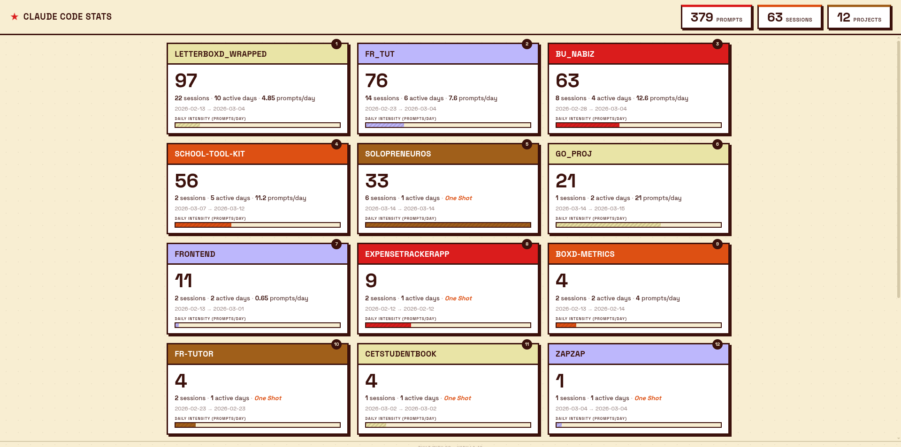

# CC Lens

A lightweight dashboard that reads Claude Code's `~/.claude/history.jsonl` and visualizes your usage — per-project prompt counts, session tracking, daily intensity, weekly/monthly activity timelines, and estimated token usage. Single binary, zero dependencies.

## Quick Start

```bash
curl -sSL https://raw.githubusercontent.com/SemihMutlu07/cc-lens/main/install.sh | bash
```

Requires [Go 1.21+](https://go.dev/dl).

## Screenshot



---

Built with Go + Vanilla JS.
